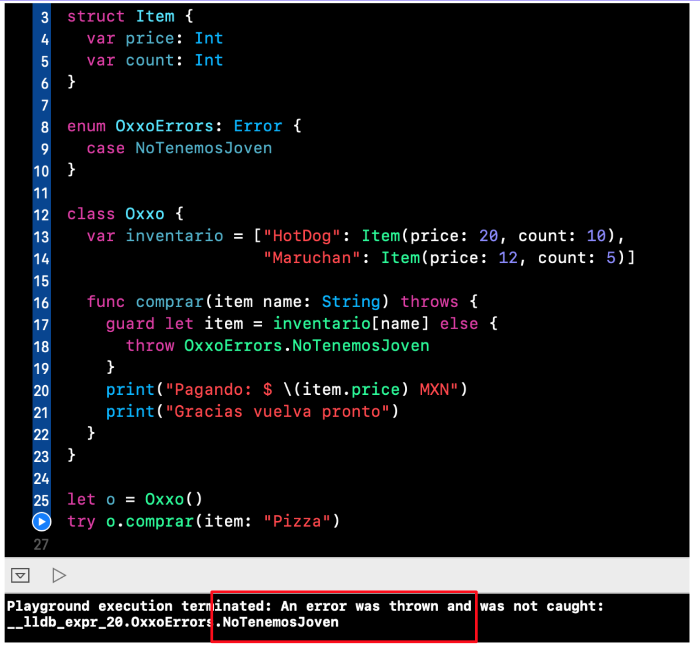

`Desarrollo Mobile` > `Swift Avanzado`

## Throws, manejando errores

### OBJETIVO

- Implementar una clase que arroje un error definido previamente.

#### REQUISITOS

1. Xcode 11
2. Playgrounds

#### DESARROLLO

Implementaremos la siguiente clase que arrojará un error en caso de que el dulce NO esté en el inventario.

Crearemos un  enum de errores a manejar, debe ser de tipo `Error`.

```
enum OxxoErrors: Error {
  case NoTenemosJoven
}
```

La clase debe arrojar este error si cumple la condición. La condición es basicamente si existe el producto en el Array dado.

```
var inventario = ["HotDog": Item(price: 20, count: 10),
                  "Maruchan": Item(price: 12, count: 5)]
```

La clase tendrá una función, el `guard` en dicha función se encargará de mandarnos a la condición de error, es ahí donde arrojaremos el Throw.

```
func comprar(item name: String) throws {
    guard let item = inventario[name] else {
      throw OxxoErrors.NoTenemosJoven
    }
    print("Pagando: $ \(item.price) MXN")
    print("Gracias vuelva pronto")
  }
```

El codigo final y output:


  
  